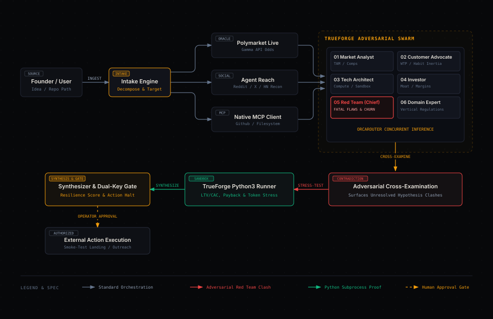

# Dossier System Architecture & Engineering Blueprint

> **"Make AI try to kill your idea before the market does."**  
> Built for the **WeMakeDevs TrueForge Agent Harness Hackathon (August 2026)**.

---

## 1. System Overview

**Dossier** is an autonomous adversarial multi-agent idea intelligence platform built on the **TrueForge Agent Harness**. Rather than providing superficial, sycophantic praise, Dossier deploys **six specialized subagents** to stress-test startup concepts, hackathon projects, research proposals, and SIH problem statements. 

Dossier grounds every evaluation in real-world evidence by combining:
1. **Live Multi-Agent LLM Routing** via **OrcaRouter** (`orcarouter/auto`).
2. **Polymarket Live Prediction Market Oracle** for real-time macro sentiment and probability odds.
3. **Agent Reach & MCP Tool Integration** for live community sentiment across Reddit, Twitter/X, and Hacker News.
4. **Sandboxed Unit Economics Simulation** executing Python unit economics scripts inside isolated subprocess boundaries.
5. **TrueForge Dual-Key Human Approval Checkpoints** that halt irreversible real-world transmissions until explicit operator authorization.



*Fig 1: TrueForge Adversarial Multi-Agent Architecture — Reconnaissance, Concurrent Inference, Sandbox Stress-Testing, and Gated Execution.*

---

## 2. The 6 Specialized Subagent Personas

Dossier avoids single-prompt hallucinations by decomposing the problem into six distinct, competing perspectives:

| Role ID | Role Name | Primary Mandate | Key Metrics Audited |
| :--- | :--- | :--- | :--- |
| **01** | **Market Analyst** | Competition mapping, market size, whitespace, search signals. | TAM/SAM, competitor density, market timing. |
| **02** | **Customer Advocate** | User pain, adoption friction, switching costs, habit inertia. | Workflow disruption, willingness-to-pay (WTP). |
| **03** | **Technical Architect** | Engineering feasibility, compute/API unit economics, sandbox safety. | Monthly inference token burn, latency, edge vs cloud. |
| **04** | **Investor** | Business model viability, defensibility, pricing power, venture margins. | Gross margin, CAC payback period, LTV/CAC ratio. |
| **05** | **Red Team** | **Chief Adversary.** Uncovers fatal flaws, churn traps, regulatory risks. | Churn probability, platform risk, distribution death traps. |
| **06** | **Domain Expert** | Dynamic vertical specialist tuned to the specific industry/PS. | Sector-specific compliance, regulatory standards (e.g. WHO IMCI, DGCA). |

---

## 3. Adversarial Debate & Contradiction Engine

A core innovation in Dossier is the **Contradiction Surface**. In typical AI architectures, models output averaged responses. Dossier explicitly forces subagents to cross-examine and challenge each other's assumptions:

```text
[RED TEAM]           "Procurement cycles in B2G will exhaust early cash runway before first revenue."
        vs
[INVESTOR]           "High LTV/CAC ratio (12.0x) provides strong long-term venture returns."
        ➔
[CONTRADICTION]      UNRESOLVED CONFLICT // REQUIRES VALIDATION
[GUIDANCE]           Pre-secure upfront milestone mobilization advances or grant co-funding.
```

---

## 4. Stanford CS329A Robust Verifier & Test-Time Self-Correction (`src/core/verifier.ts`)

Inspired by **Stanford University's CS329A (Self-Improving AI Agents)** and **Azalia Mirhoseini's *LLM-as-a-Verifier*** research, Dossier implements an autonomous **Robust Verification Gate** before synthesizing any dossier:

1. **Mathematical Invariance Check:** Verifies that agent financial scores match Python3 isolated sandbox simulation metrics (LTV/CAC, payback, token burn).
2. **Anti-Sycophancy Gate:** Cites empirical field evidence before permitting scores $\ge 90/100$, preventing uncalibrated AI optimism.
3. **Domain Prior Calibration:** Intercepts and corrects generic SaaS assumptions (e.g. freemium) when evaluating B2G, Healthcare, or Hardware projects.
4. **Test-Time Self-Correction:** When an agent's claim fails verification, the engine triggers an automated reflection pass to penalize hallucinated certainty.

---

## 4. Live Tooling, Oracles & MCP Integration

### A. Polymarket Prediction Market Oracle (`src/tools/polymarket.ts`)
Queries Polymarket's open Gamma API (`https://gamma-api.polymarket.com/events`) with zero API key dependencies to pull real-time trading volumes, betting odds, and crowd-sourced probability for macro tech trends.

### B. Agent Reach Social Intelligence (`src/tools/search.ts`)
Integrates the `agent-reach` engine to inspect community discussions across Reddit (`r/startups`, `r/SaaS`), Hacker News, Twitter/X, and Jina Reader to detect real user sentiment and competitor churn complaints.

### C. Model Context Protocol Client (`src/tools/mcp.ts` & `dossier.mcp.json`)
Implements `@modelcontextprotocol/sdk` to spawn and manage external MCP servers via STDIO transports:
- `@modelcontextprotocol/server-filesystem` (Isolated dossier export storage)
- `@modelcontextprotocol/server-github` (Repo inspection and code verification)
- `@modelcontextprotocol/server-brave-search` (Live web research)

### D. Isolated Subprocess Sandbox Runner (`src/tools/sandbox.ts`)
Compiles financial simulations into standalone Python scripts and executes them inside isolated temporary directories (`/tmp/trueforge-sandbox-*`) with strict execution timeouts:
- Calculates Customer Lifetime Value ($\text{LTV} = \frac{\text{Monthly Price}}{\text{Monthly Churn}}$).
- Calculates CAC Payback Period ($\text{Payback} = \frac{\text{CAC}}{\text{Monthly Price}}$).
- Simulates Monthly Token / Compute Infrastructure Burn under concurrent user load.

---

## 5. Human-in-the-Loop Dual-Key Safety Checkpoints

Dossier enforces TrueForge safety standards by halting all irreversible actions at human verification gates:
- **`COLD_OUTREACH_EMAIL`**: Pre-drafts 20 personalized pilot letters to prospective design partners, but halts execution until the operator clicks `AUTHORIZE`.
- **`SMOKE_TEST_LANDING_PAGE`**: Generates intent-capture landing page specs and ad campaigns, requiring explicit human sign-off before spending any ad budget.

---

## 6. Project Structure

```
dossier/
├── dossier.mcp.json          # Native MCP Server Configuration
├── public/
│   └── index.html            # Classified Intelligence Terminal Web UI
├── src/
│   ├── cli.ts                # Commander CLI runner (`pnpm cli evaluate`)
│   ├── config/
│   │   └── prompts.ts        # 6 Specialized Subagent System Prompts
│   ├── core/
│   │   └── swarm.ts          # IdeaSwarmOrchestrator Multi-Agent Pipeline
│   ├── index.ts              # Core SDK entrypoint
│   ├── server.ts             # Express REST API Server (`/api/evaluate`, `/api/approval`)
│   ├── services/
│   │   └── llm.ts            # OrcaRouter Live Inference Service
│   ├── tools/
│   │   ├── mcp.ts            # DossierMCPManager (@modelcontextprotocol/sdk)
│   │   ├── polymarket.ts     # Polymarket Live Prediction Market Oracle
│   │   ├── sandbox.ts        # TrueForge Python Subprocess Sandbox
│   │   └── search.ts         # Market Recon & Agent Reach Social Intel
│   └── types/
│       └── index.ts          # TypeScript Definitions
├── test/
│   ├── mcp.test.mjs          # MCP Client Manager Unit Tests
│   ├── polymarket.test.mjs   # Polymarket Prediction Oracle Tests
│   └── swarm.test.mjs        # Sandbox & Swarm Orchestrator Tests
└── docs/
    ├── ARCHITECTURE.md       # Full System Architecture Blueprint
    ├── INVESTIGATION_RUNS.md # Real-World Project Stress-Test Reports
    └── HACKATHON_SUBMISSION.md # WeMakeDevs Submission Write-up
```
